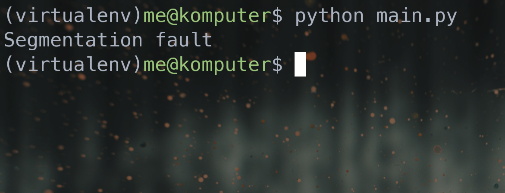

# Segmentation fault in python
What I learnt while trying to make the python interpreter crash with my favourite error : segfault.  
Note: This is not a vulnerability and it isn't a new discovery at all.
* The python docs has a [collection of good short tutorials](https://docs.python.org/3/howto/index.html) which are also available locally (check the docs folder in your installation). I remember going through the `argparse` tutorial which was really detailed but still approachable.
* The `id` function in python returns the virtual address of an object and an integer takes up 64 bits of space by default.
* Trying to read a buffer of memory from address 0 with `ctypes.string_at` does not crash the interpreter.
* Calling the "string_at" function without a length argument at addr. 0 does cause a segfault. Took way too long to realise this. There were other methods of doing this, e.g. overflowing the stack or using up too many resources but I wanted to do it by trying to access the memory location at 0.
* An address sanitise option exists in clang and gcc which gives you an error message with good detail. Add the flag `-fsanitize=address` to use it.
* Since I could not find anything useful immediately, I decided to use the ol' reliable method of de-referencing NULL. It's not too difficult to come up with a small C extension for python. There's a lot of boilerplate code you need to write but I think that might not be so much of an issue when you are writing a module with multiple methods or a package with multiple modules. I used the [realpython tutorial on building a C extension module for python](https://realpython.com/build-python-c-extension-module/) and completely skipped the exception part.
* Installing a package and creating a `setup.py` was not painful, although I expected it to be. Trying to read error messages from the Visual Studio compiler was bad (as expected? It was a variable redeclaration problem).
* The `source` command is a shell-builtin and does not work with `sh`. Changing the PS1 for bash was fun and somewhat intuitive.
* The `__new__` dunder method creates an object of the class and therefore, is a static method while the `__init__` dunder method initialises it.
* Python uses a reference count to keep track of objects and a garbage collector to delete free memory locations. You can have a weak reference to an object which can be used to access an object but not enough to prevent a garbage collector from removing it once all normal references have been deleted. It can also be used when you have circular references which might prevent the garbage collector from freeing up dead objects. Example of a circular reference: A tree where children have a link to their parent. [More details in this answer](https://stackoverflow.com/questions/1507566/how-and-when-to-appropriately-use-weakref-in-python).
* It was slightly annoying that there was a much easier way to segfault than that mess with C but then I found this really cool [gist that generates a segfault in an unusual way](https://gist.github.com/coolreader18/6dbe0be2ae2192e90e1a809f1624c694). Apparently, the C source code which handles exception does not validate the exception type correctly (?? not sure about that) and that leads to it de-referencing a null pointer :)
* Then I found out that the creator of that post is part of the org. which is rewriting the CPython interpreter in Rust, found over here at [RustPython](https://github.com/RustPython/RustPython), so that python programs can be accessed in Rust (I think this also means that there are fewer chances of memory-related bugs in the interpreter?). Anyways, fun fact, RustPython can be compiled to [WebAssembly](https://webassembly.org/) which means that you can run Python programs in the browser! I wonder what kind of access it has to DOM and other browser capabilities.  
That's all I could recollect from that session of eagerly waiting for the "SIGSEGV" text to pop up on the shell (kind of unusual no?). It did work! Here's a smol screenshot of the end result with my approach (with a C module):
 