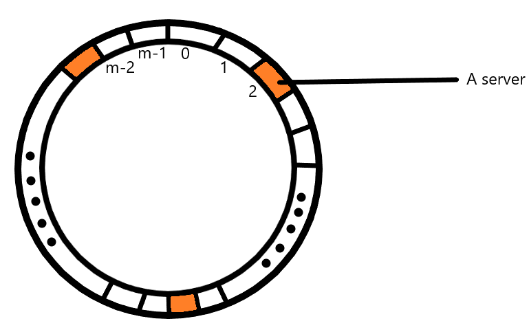

# System Design
Notes on what I learnt from [Gaurav Sen's system design playlist](https://www.youtube.com/playlist?list=PLMCXHnjXnTnvo6alSjVkgxV-VH6EPyvoX). I think that there are a lot of interesting and new ideas involved in designing a modern system and hope to be able to use those concepts while designing and implementing computer systems myself.  

## Scaling systems
Scaling is the process of modifying your system so it can reliably and efficiently provide access to your program to an increasing number of users who might be accessing the system in parallel. You can achieve this by scaling **horizontally**, which means adding multiple similar machines or by scaling **vertically** which means upgrading the machine you have to make it more powerful.  
* Horizontal: Reliable. Easy to add more nodes as number of users increase. Needs load balancing. Inter-node communication (slow). Data inconsistency is possible.
* Vertical: Single point of failure. Harder to upgrade. No load balancing. Intra-process communication (fast). Data is consistent.
Real world systems use a combination of both. They do vertical first and then start adding multiple of those powerful machines.

## An overview
There's high-level-system-design (HLD) which deals with actual systems and an architectural overview of how they interact (which is what the playlist is about) and then there's low-level-system-design (LLD) which deals with code for HLD and diagrams with fine details.  
Some important concepts, which are solutions to technical problems that come up while scaling a system:
* Horizontal & Vertical scaling.
* Backing up - back up data and keep reserve machines ready in case of failures.
* Microservices architecture - Different subsets of tasks are created and they are dealt with in isolation.
* Distributed architecture - Multiple similar systems, to handle high loads.
* Load balancing - Intelligently pass requests to a distributed system based on its info about them.
* Decoupling - Separation of responsibilities amongst unrelated entities in a system.
* Logging - The logs can be analysed to improve the efficiency of the system or detect problems.
* Extensible - The software should be easy to modify in case the requirements change.

## Load balancing
This seemed to be a two part video along with the next topic. Load balancing wrt scaling means distributing incoming requests to servers so that none of them is overwhelmed by requests when another one is relatively free.  
Requests here are represented by request IDs which can be any random integer. They must be mapped to the server space with N nodes 0..N-1. This is done with a hash function (and the mod operator). The hash function's output space is 0..M-1. The problem with `h(r_id) % N` is that when you change N, the request to server mapping is shuffled around a lot. Why is that an issue?
* Given N systems receiving requests, each server will keep some cached information about the requests it receives.
* When another system is added, the requests that each server gets could be vastly different from the ones it used to receive. Which means the cached information needs to be refreshed.  
To make sure that we use as much of the previously cached information as possible our goal is to create a hash function that does not vary its outputs a lot when the number of servers changes. This is discussed in consistent hashing.

## Consistent hashing
The problem of distributing load evenly can be solved with the hash function but modifications are required to make sure it operates smoothly when the number of servers is changed. Firstly, the way we visualise allocation of requests to servers is changed.  
We operate on the hash output space which is 0..M-1. This can be viewed as a circle of slots, like this:

* First, get the locations of the servers by passing their IDs through the hash function `h(server_id)`.
* Get the location of a request by passing its id through a hash function: `h(r_id)`.
* For each request, find the closest server in the clockwise direction.

This model still has issue of skewing when the number of servers change. Especially when the number of servers is small compared to M. To fix that we **get K locations for each server. Each location is got by `h(server_id + 'i')` where i goes from 0 to K-1.** This creates a more uniform distribution of servers even when there are less servers. A good value for K would be log(M).
